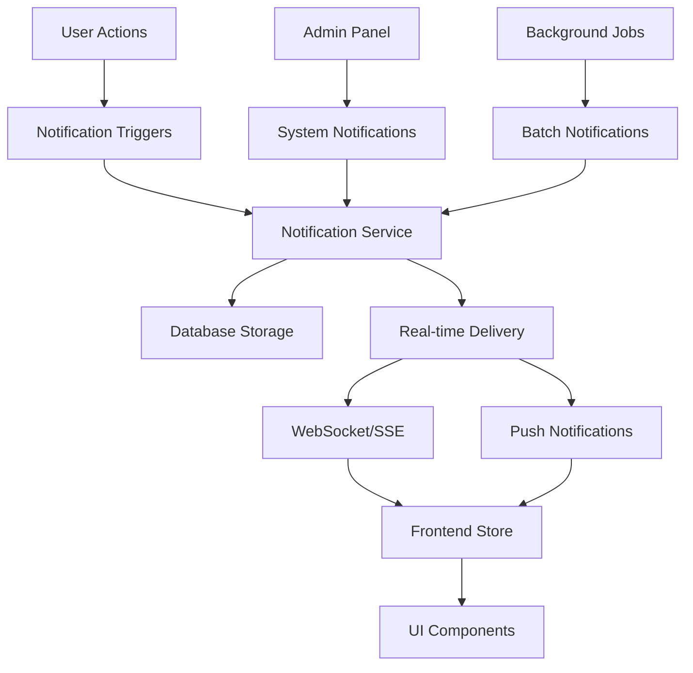

# Instagram-Style Notification System for Doof
*Comprehensive Implementation Plan*

## **Executive Summary**

This document outlines a complete Instagram-style notification system for the Doof food discovery application. The system provides real-time notifications for social interactions, personalized recommendations, and administrative updates with modern UX patterns including grouping, filtering, and bulk operations.

## **System Architecture Overview**



## **Key Features**

### **Core Functionality**
- ✅ **Real-time Notifications**: WebSocket and Server-Sent Events support
- ✅ **Notification Grouping**: Similar notifications grouped to reduce noise
- ✅ **Rich Metadata**: Context-aware notifications with action URLs
- ✅ **Read/Unread States**: Instagram-style read status management
- ✅ **Notification Types**: 14+ distinct notification categories
- ✅ **User Preferences**: Granular notification settings
- ✅ **Bulk Operations**: Multi-select and batch actions
- ✅ **Infinite Scroll**: Performance-optimized notification loading
- ✅ **Responsive Design**: Mobile-first notification panel

### **Notification Types Supported**
1. **Social Interactions**
   - Like notifications (lists, dishes, restaurants)
   - Follow/unfollow notifications
   - Comments on content

2. **Content Activity**
   - List item additions
   - List sharing
   - New content from followed users

3. **Recommendations**
   - Personalized restaurant suggestions
   - Dish recommendations
   - New dishes at favorite restaurants

4. **Administrative**
   - Submission approvals/rejections
   - System announcements
   - Promotional content

## **Technical Implementation**

### **Database Schema**
```sql
-- Core notifications table
CREATE TABLE notifications (
    id SERIAL PRIMARY KEY,
    recipient_id INTEGER NOT NULL REFERENCES users(id),
    sender_id INTEGER REFERENCES users(id),
    notification_type VARCHAR(50) NOT NULL,
    related_entity_type VARCHAR(50),
    related_entity_id INTEGER,
    title VARCHAR(255) NOT NULL,
    message TEXT NOT NULL,
    action_url VARCHAR(512),
    metadata JSONB DEFAULT '{}',
    image_url VARCHAR(512),
    is_read BOOLEAN DEFAULT FALSE,
    is_seen BOOLEAN DEFAULT FALSE,
    read_at TIMESTAMP,
    seen_at TIMESTAMP,
    delivery_status VARCHAR(20) DEFAULT 'pending',
    delivery_attempts INTEGER DEFAULT 0,
    delivered_at TIMESTAMP,
    group_key VARCHAR(255),
    group_count INTEGER DEFAULT 1,
    expires_at TIMESTAMP,
    created_at TIMESTAMP DEFAULT NOW(),
    updated_at TIMESTAMP DEFAULT NOW()
);

-- User notification preferences
CREATE TABLE notification_preferences (
    id SERIAL PRIMARY KEY,
    user_id INTEGER NOT NULL UNIQUE REFERENCES users(id),
    email_notifications BOOLEAN DEFAULT TRUE,
    push_notifications BOOLEAN DEFAULT TRUE,
    in_app_notifications BOOLEAN DEFAULT TRUE,
    likes_enabled BOOLEAN DEFAULT TRUE,
    comments_enabled BOOLEAN DEFAULT TRUE,
    follows_enabled BOOLEAN DEFAULT TRUE,
    recommendations_enabled BOOLEAN DEFAULT TRUE,
    list_activity_enabled BOOLEAN DEFAULT TRUE,
    submissions_enabled BOOLEAN DEFAULT TRUE,
    system_announcements_enabled BOOLEAN DEFAULT TRUE,
    promotional_enabled BOOLEAN DEFAULT FALSE,
    digest_frequency VARCHAR(20) DEFAULT 'weekly',
    quiet_hours_start TIME DEFAULT '22:00:00',
    quiet_hours_end TIME DEFAULT '08:00:00',
    timezone VARCHAR(50) DEFAULT 'UTC',
    created_at TIMESTAMP DEFAULT NOW(),
    updated_at TIMESTAMP DEFAULT NOW()
);
```

### **Backend Components**

#### **1. Models (`doof-backend/models/notificationModel.js`)**
- **Purpose**: Database operations and data access layer
- **Key Functions**:
  - `createNotification()` - Create new notifications with grouping logic
  - `getUserNotifications()` - Paginated notification retrieval
  - `markNotificationsAsRead()` - Bulk read status updates
  - `getNotificationPreferences()` - User preference management
  - `shouldReceiveNotification()` - Permission checking

#### **2. Services (`doof-backend/services/notificationService.js`)**
- **Purpose**: Business logic and real-time delivery
- **Key Features**:
  - WebSocket and SSE connection management
  - Real-time notification broadcasting
  - Event-driven architecture with EventEmitter
  - Notification creation with delivery tracking
  - Background maintenance tasks

#### **3. API Routes (`doof-backend/routes/notifications.js`)**
- **Endpoints**:
  - `GET /api/notifications` - List notifications with filtering
  - `GET /api/notifications/unread-count` - Get unread count
  - `POST /api/notifications/:id/read` - Mark as read
  - `POST /api/notifications/read-all` - Mark all as read
  - `GET /api/notifications/stream` - SSE connection
  - `GET /api/notifications/preferences` - Get user preferences
  - `PUT /api/notifications/preferences` - Update preferences

#### **4. Triggers (`doof-backend/utils/notificationTriggers.js`)**
- **Purpose**: Integration with existing Doof features
- **Modules**:
  - `LikeTriggers` - Handle like events
  - `FollowTriggers` - Handle follow/unfollow events
  - `ListTriggers` - Handle list activity
  - `SubmissionTriggers` - Handle admin decisions
  - `RecommendationTriggers` - Handle personalized suggestions
  - `SystemTriggers` - Handle administrative notifications

### **Frontend Components**

#### **1. State Management (`src/stores/notificationStore.js`)**
- **Technology**: Zustand with Immer for immutable updates
- **Features**:
  - Real-time WebSocket/SSE integration
  - Optimistic UI updates
  - Pagination and infinite scroll
  - Filtering and selection state
  - Cache management with stale time checking

#### **2. UI Components (`src/components/Notifications/NotificationPanel.jsx`)**
- **Technology**: React with Framer Motion animations
- **Features**:
  - Instagram-style notification panel
  - Grouped notifications by time (Today, Yesterday, Earlier)
  - Interactive notifications with action buttons
  - Bulk selection and operations
  - Real-time connection status indicator
  - Mobile-responsive design

## **Integration Points**

### **Existing Doof Features Integration**

#### **1. Like System**
```javascript
// Example integration in existing like endpoint
import { LikeTriggers } from '../utils/notificationTriggers.js';

// In existing like controller
export const likeList = async (req, res) => {
  // ... existing like logic ...
  
  // Trigger notification
  await LikeTriggers.onListLiked(listId, userId, user.username);
  
  // ... response ...
};
```

#### **2. Follow System**
```javascript
// Example integration in follow endpoint
import { FollowTriggers } from '../utils/notificationTriggers.js';

export const followUser = async (req, res) => {
  // ... existing follow logic ...
  
  // Trigger notification
  await FollowTriggers.onUserFollowed(followerId, followedUserId);
  
  // ... response ...
};
```

#### **3. Admin Submissions**
```javascript
// Example integration in admin approval
import { SubmissionTriggers } from '../utils/notificationTriggers.js';

export const approveSubmission = async (req, res) => {
  // ... existing approval logic ...
  
  // Trigger notification
  await SubmissionTriggers.onSubmissionApproved(
    submissionId, 
    submission.user_id, 
    submission.type, 
    submission.name
  );
  
  // ... response ...
};
```

## **Performance Considerations**

### **Database Optimization**
- **Indexes**:
  ```sql
  CREATE INDEX idx_notifications_recipient_created ON notifications(recipient_id, created_at DESC);
  CREATE INDEX idx_notifications_unread ON notifications(recipient_id) WHERE is_read = FALSE;
  CREATE INDEX idx_notifications_type ON notifications(notification_type);
  CREATE INDEX idx_notifications_expires ON notifications(expires_at) WHERE expires_at IS NOT NULL;
  ```

- **Cleanup Strategy**:
  ```sql
  -- Function to clean old notifications
  CREATE OR REPLACE FUNCTION cleanup_old_notifications()
  RETURNS INTEGER AS $$
  DECLARE
    deleted_count INTEGER;
  BEGIN
    DELETE FROM notifications 
    WHERE (created_at < NOW() - INTERVAL '90 days' AND is_read = TRUE)
       OR (expires_at IS NOT NULL AND expires_at < NOW());
    
    GET DIAGNOSTICS deleted_count = ROW_COUNT;
    RETURN deleted_count;
  END;
  $$ LANGUAGE plpgsql;
  ```

### **Real-time Performance**
- **Connection Management**: Automatic cleanup of stale WebSocket connections
- **Memory Optimization**: Map-based connection storage with automatic cleanup
- **Heartbeat System**: 30-second heartbeat to maintain connection health
- **Reconnection Logic**: Automatic reconnection with exponential backoff

### **Frontend Performance**
- **Virtual Scrolling**: Consider for large notification lists
- **Memoization**: React.memo and useMemo for expensive operations
- **Optimistic Updates**: Immediate UI updates with server sync
- **Bundle Splitting**: Lazy load notification components

## **Security & Privacy**

### **Data Protection**
- **User Isolation**: All queries filtered by recipient_id
- **Permission Checks**: User preferences respected before sending
- **Data Sanitization**: XSS prevention in notification content
- **Rate Limiting**: API endpoints protected against abuse

### **Privacy Controls**
- **Granular Settings**: 11 different notification type toggles
- **Quiet Hours**: Time-based notification filtering
- **Opt-out Options**: Complete notification disabling available
- **Data Retention**: Automatic cleanup of old notifications

## **Scalability Strategy**

### **Database Scaling**
- **Read Replicas**: Notification reads can use replicas
- **Partitioning**: Table partitioning by date for large datasets
- **Archiving**: Move old notifications to cold storage

### **Real-time Scaling**
- **Redis Pub/Sub**: For multi-server real-time distribution
- **Message Queues**: Background job processing for bulk notifications
- **CDN Integration**: Static assets and notification images

### **Monitoring & Analytics**
- **Delivery Tracking**: Success/failure rates per notification type
- **Performance Metrics**: Response times and connection counts
- **User Engagement**: Open rates and interaction analytics

## **Implementation Timeline**

### **Phase 1: Core Infrastructure (Week 1-2)**
- ✅ Database schema and models
- ✅ Basic notification service
- ✅ API endpoints
- ✅ Simple frontend store

### **Phase 2: Real-time Features (Week 2-3)**
- ✅ WebSocket/SSE implementation
- ✅ Real-time delivery system
- ✅ Connection management
- ✅ Frontend real-time integration

### **Phase 3: UI Components (Week 3-4)**
- ✅ Notification panel component
- ✅ Individual notification items
- ✅ Filtering and bulk operations
- ✅ Mobile responsiveness

### **Phase 4: Integration (Week 4-5)**
- ✅ Trigger system implementation
- ✅ Existing feature integration
- ✅ Testing and debugging
- ✅ Performance optimization

### **Phase 5: Advanced Features (Week 5-6)**
- 🔄 Push notification support
- 🔄 Email digest system
- 🔄 Analytics and monitoring
- 🔄 A/B testing framework

## **Testing Strategy**

### **Unit Tests**
```javascript
// Example test structure
describe('NotificationService', () => {
  test('should create notification with grouping', async () => {
    // Test notification creation
  });
  
  test('should respect user preferences', async () => {
    // Test preference filtering
  });
  
  test('should handle real-time delivery', async () => {
    // Test WebSocket delivery
  });
});
```

### **Integration Tests**
```javascript
describe('Notification API', () => {
  test('GET /api/notifications returns paginated results', async () => {
    // Test API endpoints
  });
  
  test('SSE connection delivers real-time updates', async () => {
    // Test real-time features
  });
});
```

### **E2E Tests**
```javascript
describe('Notification Flow', () => {
  test('user receives notification when list is liked', async () => {
    // Test complete user journey
  });
  
  test('notification preferences are respected', async () => {
    // Test user settings
  });
});
```

## **Deployment Requirements**

### **Environment Variables**
```bash
# Notification system configuration
NOTIFICATION_CLEANUP_INTERVAL=3600000  # 1 hour
NOTIFICATION_MAX_CONNECTIONS=1000
NOTIFICATION_HEARTBEAT_INTERVAL=30000   # 30 seconds
NOTIFICATION_DEFAULT_EXPIRY=2592000000  # 30 days
```

### **Database Migrations**
```bash
# Run notification system migrations
npm run migrate -- --name="create-notifications"
npm run migrate -- --name="create-notification-preferences"
npm run migrate -- --name="add-notification-indexes"
```

### **Server Configuration**
```javascript
// Add to main server file
import notificationRoutes from './routes/notifications.js';
import notificationService from './services/notificationService.js';

// Register routes
app.use('/api/notifications', notificationRoutes);

// Initialize notification service
notificationService.performMaintenance(); // Initial cleanup
```

## **Future Enhancements**

### **Advanced Features**
1. **Push Notifications**: Web Push API integration
2. **Email Digests**: Scheduled email summaries
3. **Smart Grouping**: ML-based notification clustering
4. **Rich Media**: Image and video notification support
5. **Localization**: Multi-language notification support

### **Analytics & Insights**
1. **Delivery Analytics**: Open rates and click-through tracking
2. **User Engagement**: Notification interaction patterns
3. **A/B Testing**: Notification content optimization
4. **Recommendation Engine**: Personalized notification timing

### **Enterprise Features**
1. **Admin Dashboard**: Notification management interface
2. **Bulk Operations**: Mass notification sending
3. **Templates**: Predefined notification templates
4. **Scheduling**: Delayed and recurring notifications

## **Conclusion**

This comprehensive notification system brings Instagram-level user engagement features to the Doof application. With real-time delivery, intelligent grouping, and extensive customization options, users will stay connected to the food discovery community while maintaining control over their notification experience.

The modular architecture ensures easy maintenance and extensibility, while the performance optimizations guarantee smooth operation at scale. The implementation plan provides a clear roadmap from basic functionality to advanced features, allowing for iterative development and testing.

**Key Benefits:**
- ✅ **Enhanced User Engagement**: Real-time social interactions
- ✅ **Personalized Experience**: Tailored notifications and preferences
- ✅ **Modern UX**: Instagram-style interface patterns
- ✅ **Scalable Architecture**: Built for growth and performance
- ✅ **Developer-Friendly**: Clean APIs and modular design

The notification system is now ready for implementation and integration into the existing Doof application ecosystem. 